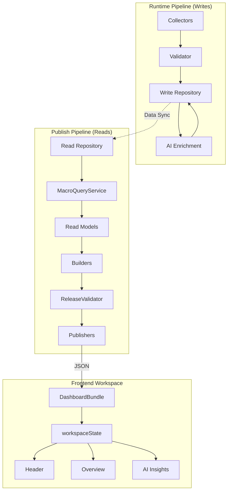

# Macro Intelligence Platform: Architecture Overview

## Business Flow

This platform processes unstructured central bank data into structured, actionable intelligence for investors. 

The end-to-end business flow:
```
Official RBI Publication
        ↓
Collection (Automated scraping/polling)
        ↓
Validation (Schema and rule enforcement)
        ↓
Persistence (Raw event storage)
        ↓
AI Enrichment (Summarization, theme extraction, sentiment)
        ↓
Persistence (Enriched event storage)
        ↓
Publishing (Static JSON compilation)
        ↓
Dashboard (Interactive workspace)
        ↓
Investor (Consumption)
```

## Architecture Summary

The platform uses a strict Command Query Responsibility Segregation (CQRS) architecture with two distinct, decoupled pipelines. This guarantees that the UI never accesses the database directly and analytical queries never impact ingestion performance.



## Non-Goals
This system intentionally does NOT:
- **Perform analytics in the UI**: The UI only renders pre-computed JSON metrics.
- **Contain business logic in Publishers**: Publishers strictly serialize `ReadModels` and perform I/O.
- **Modify official data via AI**: AI insights are strictly partitioned into `derived_data`.
- **Read repositories from the Dashboard**: The frontend knows nothing of the backend DB.
- **Depend on GitHub Pages in the Runtime**: The runtime pipeline runs asynchronously and independently of the hosting provider.
